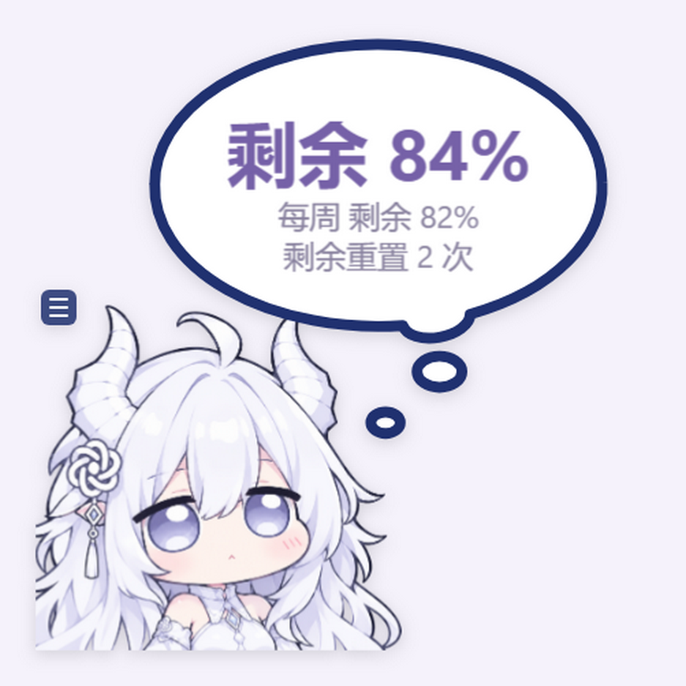
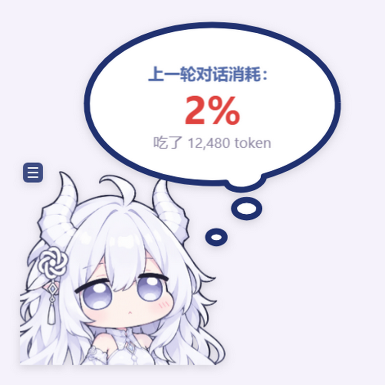
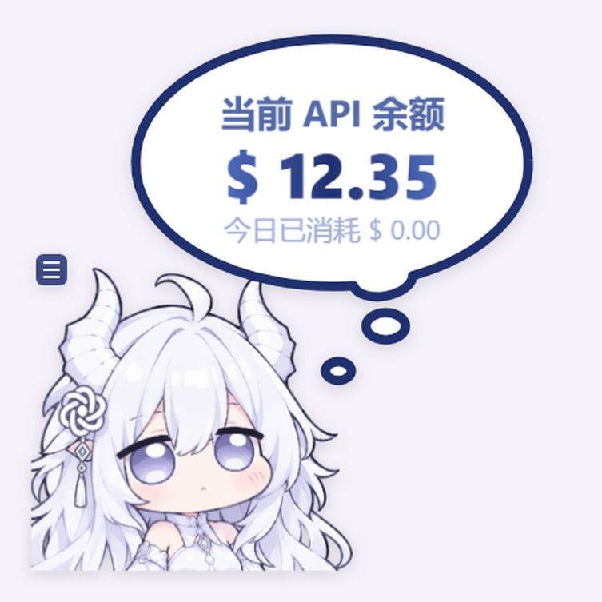

# 大肥龙 Codex 额度挂件

一个跟随 Codex 桌面窗口运行的 Windows 小挂件，显示官方订阅额度或 API 余额，并在每轮对话结束后显示本轮消耗。项目基于 [dsh-whale-widget](https://github.com/MeteorNOX/DeepSeek-Balance-Whale-Widget) 的 Codex 适配分支改编。

## 外观与气泡

以下配图重新截取自当前挂件，完整展示角色和气泡，数值使用示例数据。

| 官方订阅额度 | 上一轮对话消耗 | API / 中转站余额 |
| --- | --- | --- |
|  |  |  |

## 使用

1. 下载项目 ZIP 并完整解压，或克隆本仓库。
2. 准备包含 npm 的 Node.js 24 或更高版本；启动器优先使用 Codex 自带的 Node，找不到时使用系统 Node。
3. 双击 `启动大肥龙.cmd`。首次启动需联网下载 Electron 桌面组件，之后使用本地缓存。
4. 打开 Codex，挂件会自动跟随其窗口显示；尚未连接时隐藏等待，关闭 Codex 后继续在后台等待。
5. 双击 `停止大肥龙.cmd` 或选择托盘菜单的“退出挂件”可退出。

点击大肥龙可以查看额度。官方订阅登录显示五小时和每周剩余百分比、可用重置次数；API 或中转站登录使用匹配的余额查询配置。服务商需支持相应余额接口，也可在菜单配置自定义查询；普通 OpenAI API Key 没有内置余额查询接口。

每轮结束后默认显示“上一轮对话消耗：”、额度变化或 API 金额，以及“吃了 xxxx token”。订阅额度来自本机日志快照，缺失或过期会明确提示；重置次数无法读取时显示 `--`。两次额度快照的差值可能包含同时运行的其他对话。

## 自定义

在挂件菜单中可以修改：

- 随机气泡文字、字体、颜色、图片和链接；
- 额度、今日消耗和每轮结算模板；
- 角色图片、动图、按压音和结束音；
- 低余额、高用量提醒及阈值。

设置、自定义素材和账本保存在 `data/`。更新时保留这个目录即可保留自己的配置。

## 查询

包内提供 Codex 查询工具：`gpt_quota`、`gpt_usage`、`gpt_balance`、`gpt_status`、`gpt_open`。需先在 Codex 中加载本目录的插件或配置 `.mcp.json`，并启动挂件；双击启动文件不会自动注册查询工具。

也可以在项目目录运行：

```text
node scripts/control.mjs quota --refresh
node scripts/control.mjs usage
node scripts/control.mjs status
```

## 许可和素材

代码和文档采用 [MIT License](LICENSE)。本项目保留上游作者 MeteorNOX 的版权声明。

`assets/` 中的图片、动图和音频不属于 MIT 授权范围，按素材来源条款原样（as-is）随本插件分发，仅供运行本插件使用；不授予再许可，不声明为本项目原创。大肥龙图片来自用户提供的素材，采用相同的分发边界；README 配图中的角色素材同样遵循这些条款。来源及第三方声明见 [PROVENANCE.md](PROVENANCE.md) 与 [THIRD_PARTY_NOTICES.md](THIRD_PARTY_NOTICES.md)。如有素材权利问题，请在本仓库提出 Issue。

## 说明

项目只读取本机 Codex 配置、日志和会话记录，不修改 Codex 安装或登录文件。请不要把 `data/` 目录、账号信息、日志或个人配置提交到公开仓库。
